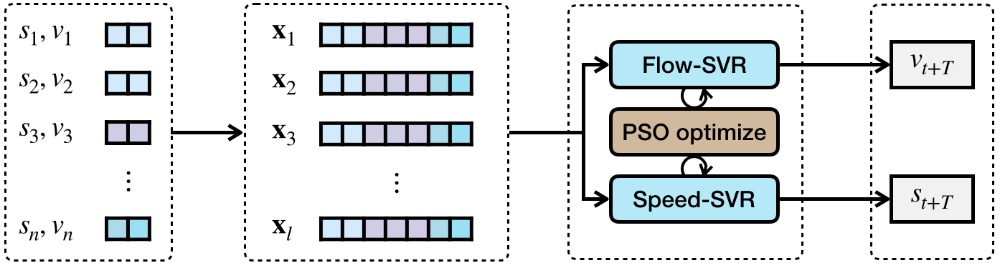
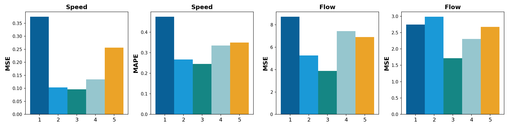
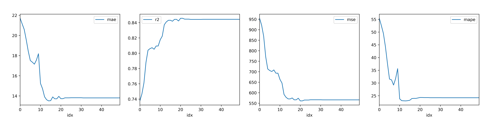
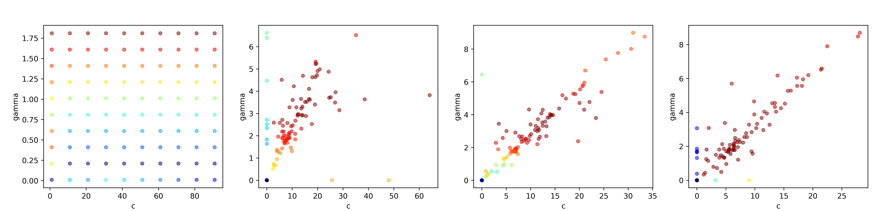

# Traffic congestion warning system based on regression analysis and memory network
SVR contains the whole system, PSO-SVR extracts the Particle Swarm Optimization on SVR moudle (reimplemented with neat code)
### SVR

* In the project, we propose a short-term off-site traffic flow prediction model based on support vector regression and long short-term memory networks, combined with fuzzy synthetic evaluation method, a traffic congestion early warning system is constructed. 
* By learning the historical traffic flow data of the upstream road section, the support vector machine regression prediction model, which has been optimized by the particle swarm optimization algorithm, can accurately estimate the average road speed and traffic flow of the upstream road section in the future. Combined with prediction results and historical data, long short-term memory networks can accurately estimate the average road speed and traffic flow of downstream road sections. The final forecast data is transformed into traffic parameters to obtain an evaluation index set including average speed, traffic flow density, and road saturation. The weights of the evaluating indicators under the morning peak, evening peak and other periods are determined by the entropy method and using the membership function to determine the evaluation matrix of each indicator. Finally, the road traffic congestion level is obtained according to the principle of maximum membership degree. Once the threshold is reached, an alarm is issued. 
* Numerical experiments are performed using the data from the No.2552 and No.2554 highway in the Caltrans Performance Measurement System of California, USA, where No.2554 is upstream and No. 2552 is downstream. The results show that the system has great performance and the prediction accuracy can reach 96%. 

### PSO-SVR
Particle Swarm Optimization on SVR. Here we introduce the arguments first:
```
--type           | 'speed' or 'flow' | we support speed and volumn prediction respectively.
--scale          |         --        | apply MinMaxScaler on the input features.
--no-scale       |         --        | does NOT apply MinMaxScaler on the input features.
--win            |        int        | indicates the window size in the timeline. e.g. 3 means considering 
                                       the speed and flow data of the previous 3 moments from given time. 
--n_iterations   |        int        | the iteration number of the whole PSO-SVR training

# PSO
--inertia_weight |       float       | the inertia_weight of PSO
--c1             |       float       | the first acceleration constant of PSO
--c2             |       float       | the second acceleration constant of PSO

# SVR
--kernel         | 'rbf','linear',...| the kernel of SVR
--epsilon        |       float       | the epsilon of SVR
--c_min          |        int        | the minimum value of regularization parameter of SVR
--c_max          |        int        | the maximum value of regularization parameter of SVR
--c_step         |        int        | the increasing margin
--gamma_min      |       float       | the minimum value of kernel coefficient for ‘rbf’, ‘poly’ and ‘sigmoid’ of SVR
--gamma_max      |       float       | the maximum value of kernel coefficient for ‘rbf’, ‘poly’ and ‘sigmoid’ of SVR
--gamma_step     |       float       | the increasing margin
```

* Train
```python
# train speed-PSO-SVR with time windows of 3 and scaled input, running 50 iteration
python3 train.py --type=speed --win=3 --scale --n_iteration=50

# train flow-PSO-SVR with time windows of 5 and non-scaled input, running 50 iteration
python3 train.py --type=flow --win=5 --no-scale --n_iteration=50
```
* Test
```python
# test speed-PSO-SVR with time windows of 3 and scaled input
python3 test.py --type=speed --win=3 --scale

# test flow-PSO-SVR with time windows of 5 and non-scaled input
python3 test.py --type=flow --win=5 --no-scale
```
* Plot
```python
# --kind |'b','c','s'|
# draw the bar plot of different time window size
python3 plot.py --type=speed --kind=b
```

```python
# draw the training curve plot of the evaluation, i.e. MSE, MAPE
python3 plot.py --type=speed --win=3 --kind=c --no-scale
```


```python
# draw the scatter plot of the Paticle Swarm duing training process
python3 test.py --type=speed --win=3 --kind=s --no-scale
```



